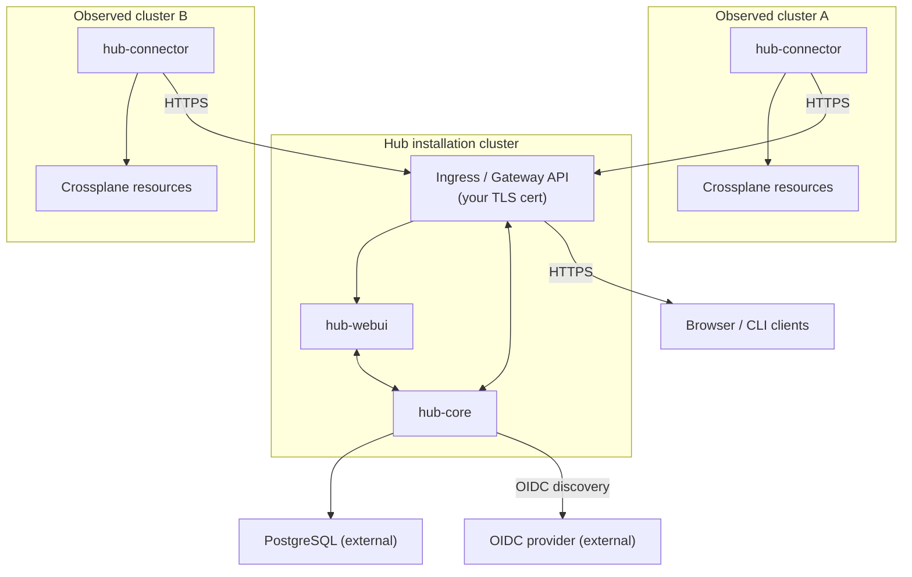

## Architecture

Hub refers generally to a set of Upbound products, spread throughout services
running on single cluster, with one or more Kubernetes clusters sending data
back through an instance of `hub-connector`. The microservices within Hub are
stateless applications storing data in external databases The `hub-core`
provides the central authority for authentication, ingest and APIs. The
`hub-webui` is an optional
web interface for interacting with the Hub.

## What you provide

- **A PostgreSQL database** The Hub requires its own database. Upbound
  officially supports only managed PostgreSQL offerings (RDS, Cloud SQL, Azure
  Database for PostgreSQL). See [the databases overview][overview] for the
  version, extensions, and authentication modes Hub supports.
- **An OIDC provider** Any OIDC-compliant provider with a discovery endpoint,
  email claim, and configurable group claim works. See [the OIDC
  overview][oidc-configuration] for the contract and the per-provider guides.
- **Ingress** Provide a Gateway API setup or an
  Ingress controller, plus a CA-signed certificate attached to hostnames that
  will expose your API and (optionally) the UI.

The full pre-flight checklist (versions, sizing, network paths) lives in
[prerequisites][prerequisites]. Read it before you move to the install page.

## What Upbound supports

Upbound tests and supports Hub when its database and supporting infrastructure
run on AWS, GCP, or Azure.
These environments are the only ones covered by Upbound support. Running Hub on any
other cloud provider, on-premises, or in a self-hosted environment is possible
but unsupported. In these configurations you are responsible for provisioning,
operating, and troubleshooting the underlying infrastructure. Upbound may
provide best-effort guidance but doesn't guarantee compatibility, performance,
or issue resolution. Any such deployment is at your own risk.

## What the chart provides

The `hub` umbrella chart installs three subcharts - `hub-core`,
`hub-webui` and `hub-connector`. `hub-core` is the only chart that's required
for an operational API that can accept resources and serve responses.
`hub-webui` is optional (but recommended) to interact with the system without
using the API directly.

- **`hub-core` Deployment.** The entrypoint API server for ingesting resources
  and accessing the Upbound Platform products.
- **`hub-webui` Deployment.** The browser UI for all of the Upbound Platform
  products. Optional, disable it if you only want the API.
- **`hub-connector` Deployment.** The component responsible for syncing state
  between connected Kubernetes control planes and `hub-core`. The architecture
  reference describes the connector's data and authentication flow.
- **Bootstrap configuration.** A Kubernetes Secret rendered from
  `hub-core.bootstrap.files`. Use it to register your initial Hub objects at
  install time. That covers the first `IdentityProvider`, the first
  `ControlPlane`, plus an `OrganizationRoleBinding` linking your OIDC admin
  group to Hub's admin role.

## Next step

Work through the section in order:

- [Prerequisites][prerequisites]. The full pre-flight checklist for cluster,
  network, storage, and dependencies.
- [OIDC configuration][oidc-configuration]. Provider contract and per-provider setup.
- [Databases overview][overview]. Postgres requirements and the AWS
  RDS guide.
- [Install][install]. `helm install` against externally managed Postgres and
  OIDC.

Once Hub is serving real traffic, the [production
overview][production-overview] covers sizing, high availability,
autoscaling, RBAC, and upgrades.

[install]: /hub/howtos/install
[oidc-configuration]: /hub/howtos/oidc-configuration
[overview]: /hub/howtos/databases/overview
[prerequisites]: /hub/howtos/prerequisites
[production-overview]: /hub/howtos/production-overview
