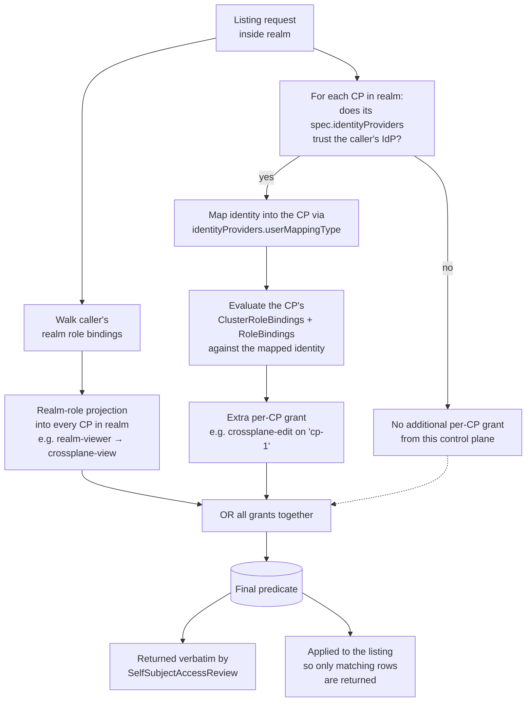

:::note[Suggested reading]
Start with the [Access management overview](overview.md) for the tenancy model
and role tiers. Identity concepts come from the [Identity
overview](../identity/overview.md).
:::

Instead of an all-or-nothing "allowed / denied" answer, Hub computes a
predicate from your grants and returns only the rows you may see. This page
explains how Hub builds the predicate and how to inspect it before writing
against it.

## Grant sources add together

A listing request inside a realm draws visibility from two independent
sources:

- **Realm roles.** `realm-admin`, `realm-editor`, and `realm-viewer` apply
  to every control plane in the realm, regardless of the control plane's
  `spec.identityProviders`. `realm-editor` and `realm-viewer` map to the
  aggregation ClusterRoles (both `crossplane-edit` and `controlplane-edit`
  for an editor, both `crossplane-view` and `controlplane-view` for a
  viewer), and whichever of those the control plane actually has contributes
  its rules. `realm-admin` is unconditional: it sees every resource the
  `hub-connector` synced, bounded by the connector's sync scope rather than
  by a ClusterRole. See [What a realm role gets inside a control
  plane](overview.md#what-a-realm-role-gets-inside-a-control-plane).
- **Per-control-plane RBAC.** Each `ControlPlane` can declare an
  `identityProviders` list. Each entry says "look up identities from this
  `IdentityProvider` inside this control plane's `ClusterRoleBinding`s and
  `RoleBinding`s, using the following mapping". If your identity matches an
  entry, Hub evaluates the control plane's own RBAC against your mapped
  username and groups and adds whatever it grants to your visibility for
  that control plane.

They combine with **OR**: you see a row if any of your grants
admits it. A `realm-viewer` in realm A already sees whatever the
`crossplane-view` / `controlplane-view` role exposes on every control plane
in A. If `prod` in A also trusts the `entra` `IdentityProvider` and has a
`ClusterRoleBinding` granting `crossplane-edit` to your user, your
visibility for `prod` becomes read+write, while the rest of A stays at the
view projection.

Per-CP RBAC via `spec.identityProviders` is purely additive: it grants
extra privileges on top of what the realm role already provides. A control
plane that lists no IdPs still gives realm-viewers and realm-editors the
base aggregation projection; `identityProviders` isn't required for realm
roles to work.



The same predicate drives both the actual listing and the answer to a
`SelfSubjectAccessReview`, so "ask `SelfSubjectAccessReview` what you would
see" is always trustworthy.

Fleet-wide aggregates inherit this predicate rather than defining one of their
own, though they attach to it at a different scope. Hub gates
`typedefinitions` on the control planes you can reach. A user can see `crossplanepackages`
in the Hub if they can see the corresponding `Provider`, `Configuration`,
`Function`, or `AddOn` CRD in the control plane otherwise.

## Pass Hub identities through to a control plane

By default, a control plane's Kubernetes RBAC applies to whatever identities
the *cluster's own* authenticator produces, typically service accounts on
that cluster. If you want the control plane's `RoleBinding` and
`ClusterRoleBinding` resources to recognize the same prefixed identities
Hub uses (`corp:alice@example.com`, `corp:platform-admins`), you tell
Hub to forward the resolved identity through unchanged.

Set `userMappingType: Exact` on the `ControlPlane`, referencing the
`IdentityProvider` whose identities should pass through:

```yaml
apiVersion: hub.upbound.io/v1beta1
kind: ControlPlane
metadata:
  name: production
  namespace: default
spec:
  identityProviders:
    - name: corp                # matches an IdentityProvider name
      userMappingType: Exact    # forward the resolved identity 1:1
```

With `Exact` mapping, the control plane sees `corp:alice@example.com` (and
groups such as `corp:platform-admins`) in its Kubernetes `user.Info` and
evaluates its own RBAC against those names.

Now you can write a control plane `ClusterRole` and `ClusterRoleBinding`
that Hub-authenticated users match:

```yaml
# Applied inside the control plane.
apiVersion: rbac.authorization.k8s.io/v1
kind: ClusterRole
metadata:
  name: rds-viewer
rules:
- apiGroups:
  - database.aws.upbound.io
  resources:
  - rdsinstances
  verbs:
  - list
---
apiVersion: rbac.authorization.k8s.io/v1
kind: ClusterRoleBinding
metadata:
  name: alice-rds-viewer
roleRef:
  apiGroup: rbac.authorization.k8s.io
  kind: ClusterRole
  name: rds-viewer
subjects:
- apiGroup: rbac.authorization.k8s.io
  kind: User
  name: "corp:alice@example.com"
```

Alice can now `list rdsinstances` on this control plane whether she reaches
the API through `kubectl` directly or through Hub. The RBAC rule fires the
same way in both cases.

### When to use pass-through

Reach for `userMappingType: Exact` when:

<!-- vale alex.Ablist = NO -->
- You want a *uniform* mental model of access across Hub and every managed
  control plane.
<!-- vale alex.Ablist = YES -->
- You already have (or want to write) fine-grained control-plane RBAC and
  don't want to duplicate the grants at the Hub tier.
- Your `IdentityProvider` and control-plane authenticator issue the same
  prefixed identities (which is what `userInfoPrefix` gives you).

Stick with the default (no `identityProviders` entry for this IdP) when:

- Your control planes authenticate against a completely different provider
  or against the host cluster only. In that case, bind Kubernetes-level
  roles against whatever identities the control plane's own authenticator
  produces, and rely on Hub's realm-role projection (see [access-management
  overview](overview.md#what-a-realm-role-gets-inside-a-control-plane))
  for coarse access from the Hub side.

:::note
`userMappingType` currently supports only `Exact`. Additional mapping
modes (translated names, group-only propagation, etc.) arrive here as Hub
adds them.
:::

## Inspect your grants with `SelfSubjectAccessReview`

`SelfSubjectAccessReview` answers "can this caller perform this verb on
this resource?" without actually performing it. It's the canonical way to
debug "why doesn't your list show anything?"

```http
POST /apis/authorization.hub.upbound.io/v1beta1/selfsubjectaccessreviews
Authorization: Bearer <hub-token>
Content-Type: application/json

{
  "apiVersion": "authorization.hub.upbound.io/v1beta1",
  "kind": "SelfSubjectAccessReview",
  "spec": {
    "hubResourceRequest": {
      "group": "hub.upbound.io",
      "version": "v1beta1",
      "resource": "resources",
      "verb": "list",
      "realm": "prod"
    }
  }
}
```

You must fully qualify `version`, `resource`, and `verb`, with no
wildcards. `subresource` and `name` are optional and narrow the review
further.

`group` is optional. Omitting it, or sending `""`, selects the Kubernetes
**core** API group. That's the same convention Kubernetes itself uses, where
`""` names the group that holds Pods, Services, and Namespaces. It isn't a
wildcard and doesn't mean "any group."

Hub serves a single resource in the core group: `namespaces`, a
read-only façade over realms. It exists so realm-scoped resources can set
`metadata.namespace=<realm-name>`, and reviewing it's how you check whether
a caller can enumerate realms through that path:

```json
{
  "spec": {
    "hubResourceRequest": {
      "group": "",
      "version": "v1",
      "resource": "namespaces",
      "verb": "list"
    }
  }
}
```

The façade serves `get` and `list` only, so a review of `create`, `update`,
or `delete` on `namespaces` comes back `Deny` for every caller regardless of
role. Realms themselves are writable through `hub.upbound.io/realms`.

Every other Hub resource lives under a group: `hub.upbound.io`,
`authorization.hub.upbound.io`, `authentication.hub.upbound.io`, and the
feature-gated `catalog.hub.upbound.io`, `metrics.hub.upbound.io`, and
`registry.hub.upbound.io` among them. Those reviews always carry an
explicit `group`.

`realm` distinguishes three cases that Kubernetes `SubjectAccessReview`
conflates into one:

| `realm` | Means |
| --- | --- |
| Omitted (null) | Cluster-scoped resources only |
| `""` | Every realm of a realm-scoped resource |
| `"prod"` | That realm |

### The response

`status.decision` carries the outcome and is always populated. It's one of
three values:

- **`Allow`.** No `status.filter`. Every row passes.
- **`Deny`.** No `status.filter`. No grant applies, so Hub rejects the
  request.
- **`Filtered`.** `status.filter` holds the row-level predicate. Hub admits
  the request, and applying that predicate to a list of the requested
  resource returns only the rows you can see.

`status.reason` and `status.error` are optional. `status.reason` is the
authorizer's human-readable explanation. `status.error` carries an error
message and can appear alongside any decision.

### The filter expression

`status.filter` is a recursive tree. Each node sets **a single one** of these
four keys:

| Key | Shape | Asserts |
| --- | --- | --- |
| `and` | `{"parts": [<node>, ...]}` | Every operand holds. At least two operands. |
| `or` | `{"parts": [<node>, ...]}` | Some operand holds. At least two operands. |
| `stringVarIn` | `{"variable": "<name>", "values": ["a", "b"]}` | The variable's value is in the set. At least one value. |
| `boolEq` | `{"variable": "<name>", "value": true}` | The boolean variable equals the literal. |

Strings have no equality variant. An equality constraint arrives as
a `stringVarIn` whose `values` list holds a single element.

`variable` is one of `kind`, `group`, `apiVersion`, `apiResource`, `name`,
`namespace`, `controlPlane`, `space`, `realm`, `owner`, or `shared`, the
same variable names the CEL `filter` parameter accepts on list endpoints.

The tree never contains a boolean constant. Hub reports an always-true
predicate as `decision: "Allow"` with no filter, and an always-false one as
`decision: "Deny"`.

A `Filtered` response for a caller who can see everything in realm `prod`,
plus the `apps` and `extensions` groups in realm `staging`:

```json
{
  "status": {
    "decision": "Filtered",
    "filter": {
      "or": {
        "parts": [
          {
            "stringVarIn": { "variable": "realm", "values": ["prod"] }
          },
          {
            "and": {
              "parts": [
                { "stringVarIn": { "variable": "realm", "values": ["staging"] } },
                { "stringVarIn": { "variable": "group", "values": ["apps", "extensions"] } }
              ]
            }
          }
        ]
      }
    }
  }
}
```

Reading a filter tells you what you can reach: a
`stringVarIn` on `controlPlane` with `values: ["cp-1"]` means `cp-1` is the
only control plane you see. If the decision is `Allow` but the list is
still empty, the grant isn't the problem. The underlying data isn't there.

## Verifying who you are

`SelfSubjectAccessReview` answers "what can you do?" `SelfSubjectReview`
answers "who does Hub think you are?" (identity, not authorization). Reach
for `SelfSubjectReview` first:

```bash
kubectl auth whoami
```

See [Verifying your identity](../identity/verifying-your-identity.md)
for interpreting the output. If the username or groups are wrong, the fix
is on the `IdentityProvider` side. If they look right and access is still
off, use the `SelfSubjectAccessReview` check described earlier.

## Related resources

- [Access management overview](overview.md)
- [Roles reference](roles-reference.md)
- [Troubleshooting access](troubleshooting.md)
