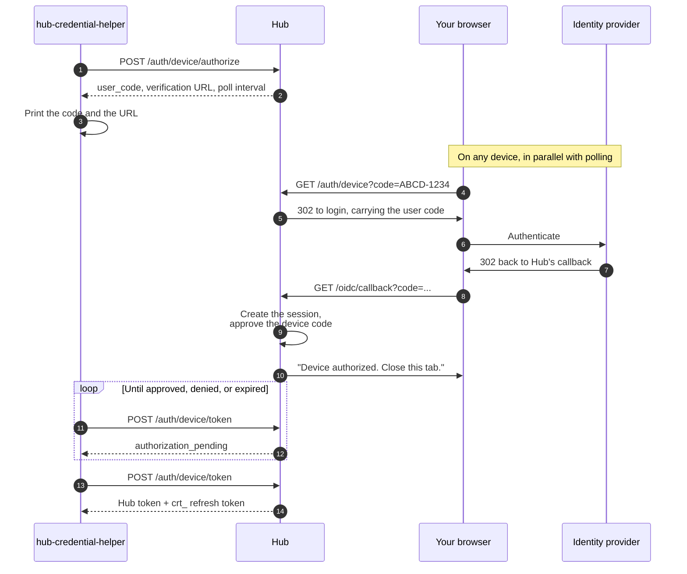

:::note[Suggested reading]
Read the [Identity overview](overview.md) first for the token flows Hub
supports.
:::

When you're at a terminal rather than a browser, `hub-credential-helper` logs
you into Hub through the OAuth 2.0 Device Authorization Grant (RFC 8628) and
caches the result. Anything that can read a bearer token off stdout, such as `curl`, a script,
or an AI agent like Claude Code, can then call Hub directly without handling
credentials itself.

Install the binary and run `hub-credential-helper --help` for the full flag and
environment-variable reference. This page covers the two commands you need.

## Log in

```bash
hub-credential-helper login --hub-url=https://hub.example.com
```

The helper prints a short user code and a verification URL. Open the URL in any
browser, sign in with your IdP, and approve the code. On approval the helper
caches a Hub access token and a refresh token on disk, so one login backs every
later call. Refresh tokens last 90 days, and Hub reaps them after 90 days of
disuse, so an actively used login effectively keeps working.

The browser doesn't have to be on the same machine as the terminal, which is
what makes this work over SSH and inside containers:



The helper never talks to your IdP and never needs its issuer URL, client ID,
or client secret. Hub holds all that information, so `--hub-url` is the only
flag an interactive login requires.

The IdP refresh token stays on the server. The cache only holds a `crt_`
handle to the session Hub created, so the revocation section below applies.

The device code expires 15 minutes after the helper prints it. If sign-in
takes longer (an MFA prompt you walked away from, say), run `login` again for
a fresh code.

## Print a token

`get-token` returns a cached, auto-refreshed Hub JWT on stdout:

```bash
curl -H "Authorization: Bearer $(hub-credential-helper get-token \
  --hub-url=https://hub.example.com)" \
  https://hub.example.com/apis/hub.upbound.io/v1beta1/resources
```

Wherever this documentation shows an `Authorization: Bearer <hub-token>` header,
`$(hub-credential-helper get-token ...)` produces that token. Pass
`--output json` instead to get the token with its expiry, which is the form an
agent or a script usually wants.

The helper caches tokens under `--cache-dir` (`HUB_CACHE_DIR`). To bypass the cache
and force a fresh token, pass `--no-cache`, or delete the cache directory.

:::tip
For day-to-day Hub work, prefer [Configure
kubectl](../../howtos/configure-kubectl.md) over passing tokens around. The
credential plugin refreshes on every command, so no token sits in your shell
history or environment.
:::

## How revocation works

Every device-flow login creates a server-side record on Hub, and the client's
refresh token only works while that record exists. A refresh token copied off
a developer's disk is inert on its own, and Hub reaps records after 90 days of
inactivity.

:::note
Hub doesn't expose an API for listing or revoking your own sessions today.
Revoking a specific login before it ages out is an operator-side database
operation.
:::

## Related resources

- [Configure kubectl](../../howtos/configure-kubectl.md): the same credentials,
  wired into `kubectl`.
- [Workload identities](workload-identities.md): the non-interactive
  counterpart for CI jobs and ServiceAccounts.
- [Identity overview](overview.md): the three token flows and how Hub resolves
  your username.
