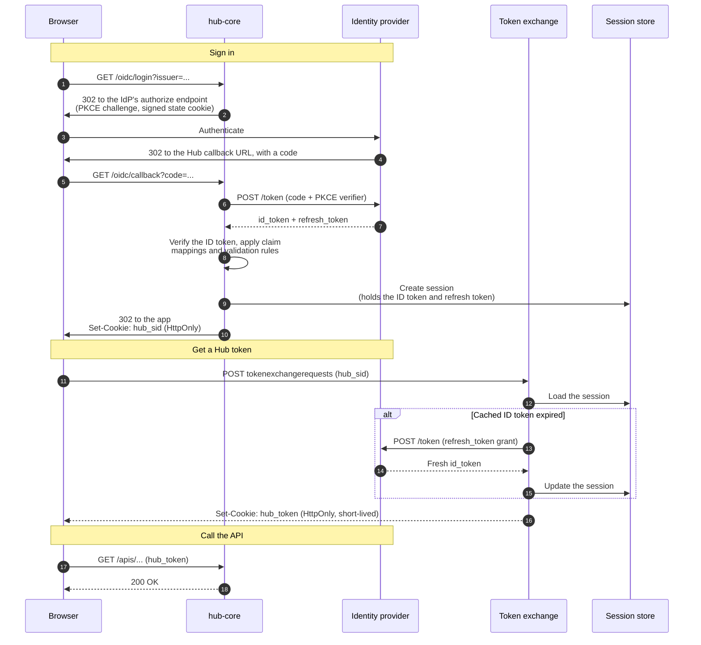

:::note[Suggested reading]
Read the [Identity overview](overview.md) first for what Hub identifies and how
tokens reach it. To register your first provider as part of a Helm install, see
[Installing Hub](../../howtos/install.md), which generates a provider from a
handful of values.
:::

An `IdentityProvider` allows you to configure which identity systems the Hub can
trust. The `IdentityProvider` represents one OIDC issuer in the
`authentication.hub.upbound.io` API group. It carries both the OAuth2 redirect
parameters for the login flow and the token-validation rules Hub applies to
every bearer token.

## A minimal provider

A complete `IdentityProvider` for a standards-compliant issuer that humans log
in through looks like this:

```yaml
apiVersion: authentication.hub.upbound.io/v1beta1
kind: IdentityProvider
metadata:
  name: entra
spec:
  redirect:
    browserLogin: true
    clientSecret: "<client-secret>"    # encrypted at rest; reads return "***"
    scopes:
      - openid
      - email
      - profile
  validation:
    # Prefix every username, group, and extra with this string. Prevents
    # collisions between IdPs and stops "system:masters" impersonation.
    # Immutable after creation. Choose it carefully.
    userInfoPrefix: "entra:"
    issuer:
      url: https://login.microsoftonline.com/<tenant-id>/v2.0
      audiences:
        - <client-id>
    claimMappings:
      username:
        # A user with email alice@example.com becomes "entra:alice@example.com".
        claim: email
      groups:
        # A group value "platform-eng" becomes the Hub group "entra:platform-eng".
        claim: groups
      extra:
        - key: authentication.hub.upbound.io/email
          valueExpression: claims.email
    claimValidationRules:
      - expression: "claims.email_verified == true"
        message: "email must be verified"
    userValidationRules:
      - expression: "user.username.endsWith('@example.com')"
        message: "email domain not permitted"
```

Apply it through the API, or place it in `hub-core`'s bootstrap directory for
GitOps-style management.

## Key knobs

- **`userInfoPrefix`.** Prepended to every value Hub reads from the username,
  group, and extras claims. Pick something short and provider-specific
  (`entra:`, `okta:`, `keycloak:`). It may contain only alphanumerics, hyphens,
  underscore characters, dots, forward slashes, and colons, and may not overlap the
  reserved `system:` or `upbound:` namespaces, which is what stops a provider
  from claiming `system:masters`.
- **`claimMappings.username`** and **`claimMappings.groups`.** Select which
  claims in the token become the Hub username and group list. `username`
  defaults to the `sub` claim; set it explicitly when you want a readable
  username such as `email`. `groups` is optional but recommended. Without it
  you can only bind roles to individual users.
- **`claimValidationRules`** and **`userValidationRules`.** CEL expressions
  Hub evaluates on every token. Failed rules reject the token. Common uses:
  require `email_verified == true`, restrict to a single email domain, or
  block reserved group prefixes.
- **`redirect.browserLogin`.** At most one `IdentityProvider` may set this to
  `true`. That provider drives the Hub UI login redirect when you register
  multiple IdPs.

### Fields you can't change later

These fields are immutable, so getting them wrong means deleting and recreating
the provider:

- **`validation.userInfoPrefix`.** Every role binding written against the old
  prefix stops matching, so a change is a migration. See [Multiple
  providers](multiple-providers.md#replacing-the-browser-login-provider).
- **`validation.issuer.url`.** Must equal the `iss` claim in issued tokens
  verbatim, including scheme, host, and path. Omit any trailing slash.

Hub also reserves certain `metadata.name` values: the names `upbound`, `ctp`,
and `space`, and anything starting with `upbound-`, `ctp-`, or `space-`, for
providers it creates itself. Unrelated names that merely begin with the same
letters, such as `spacex`, are fine.

### Defaults worth knowing

- **`redirect.scopes`** defaults to `["openid", "email", "profile"]` and must
  include `openid`. Hub rejects a provider without it.
- **A `sub` claim is always required.** Hub prepends a claim-validation rule of
  its own demanding a non-empty string `sub`, regardless of what you map the
  username to. Hub rejects a token without one before your own rules run.

### The redirect URI

The `IdentityProvider` doesn't carry a redirect URI. Hub composes the callback
from the externally reachable base URL of `hub-core`
(`<base-url>/oidc/callback`), so the URI you register with your provider has
to match that host verbatim. On a Helm install the base URL is
`hub-core.api.externalURL`. See [Installing Hub](../../howtos/install.md).

## What browser login does

Registering the provider above wires up the flow below. Understanding it
helps for two reasons: it shows why the redirect URI has to match, and it
shows where the IdP stays in the loop after the initial sign-in.



The following properties of this flow matter operationally:

- **Neither the IdP's ID token nor its refresh token reaches the browser.**
  They live on the session row. The browser holds only `hub_sid`, an opaque
  HMAC-signed handle, and `hub_token`, the short-lived Hub JWT. Both are
  `HttpOnly`, so page JavaScript never sees either.
- **The token exchange endpoint is a separate server.** It listens on its own
  port and accepts session cookies and IdP tokens; the main API port accepts
  only Hub-signed JWTs. That keeps the fast verification path free of database
  lookups.
- **The IdP stays in the loop.** Hub extends a session by redeeming the stored
  refresh token, not by minting a long-lived credential of its own. See
  [Revocation](overview.md#revocation-and-session-lifetime).

Logging out at `/oidc/logout` deletes the session, clears both cookies, and,
when the IdP advertises an `end_session_endpoint`, redirects through it with
`id_token_hint`, so the IdP clears its own SSO cookies instead of signing you
back in without asking.

## Multiple providers

You can register any number of `IdentityProvider` resources. The
token-exchange endpoint accepts every provider's tokens, so a second provider
is the normal way to admit CI and workload identities alongside your human
IdP.

Hub enforces uniqueness rules across providers, including one browser-login
holder, no shared issuer URLs, and no overlapping `userInfoPrefix` values, and
moving browser login between providers takes a specific sequence. See
[Multiple providers](multiple-providers.md).

## Sample identity providers

The fields above mean the same thing for every provider. What differs is how
each one emits group claims and what its issuer URL looks like, so a complete
worked `IdentityProvider` (app registration, issuer URL format, group-claim
setup, and directory configuration where it applies) lives on its own page:

- [Amazon Cognito](amazon-cognito.md)
- [Google Workspace](google-workspace.md)
- [Keycloak](keycloak.md)
- [Microsoft Entra ID](entra-id.md)
- [Okta](okta.md)

A provider that isn't listed still works as long as it's OIDC-compliant: a
stable issuer URL publishing `.well-known/openid-configuration`, the
authorization code flow, and a claim carrying group membership. The
[Keycloak](keycloak.md) and [Okta](okta.md) pages are the closest templates to
start from.

## Related resources

- [Identity overview](overview.md): what Hub identifies, and the token
  lifecycle these settings govern.
- [Multiple providers](multiple-providers.md): uniqueness rules and moving
  browser login between providers.
- [Verifying your identity](verifying-your-identity.md): read back the
  username and groups your claim mappings produce.
- [Directory sync](directory-sync.md): let Hub search the IdP for subjects to
  put in role bindings.
- [Installing Hub](../../howtos/install.md): the Helm values that generate a
  provider for you.
