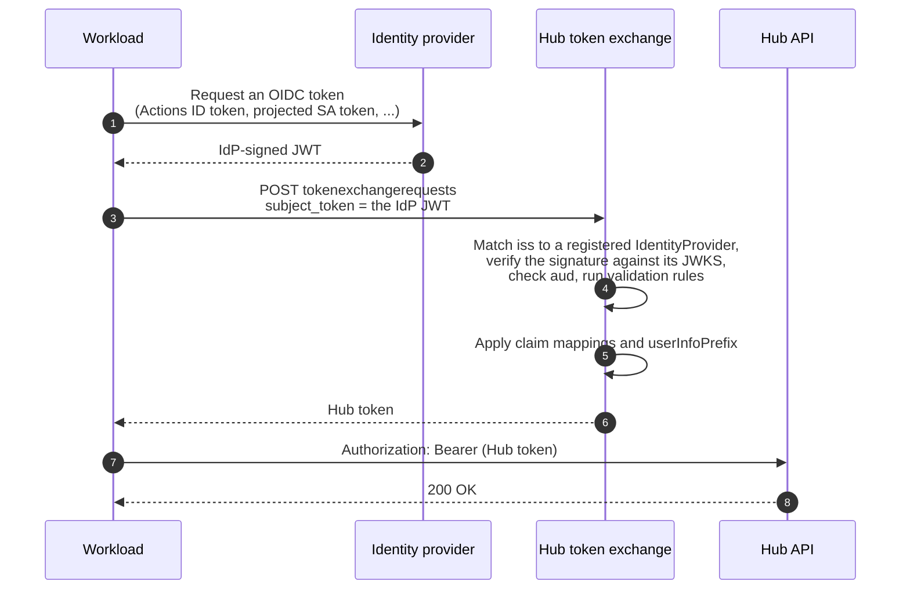

:::note[Suggested reading]
Read the [Identity overview](overview.md) first for the `IdentityProvider`
resource, `userInfoPrefix`, and claim mappings.
:::

The Hub API serves humans and machine callers. A *workload identity* is a
machine caller, such as a CI job, a pipeline, an agent, or a ServiceAccount.
Hub authenticates it the same way it authenticates a person, from claims in a
JWT.

This page covers what a workload's Hub username looks like and how it trades its
native credential for a Hub token. To grant it permissions once it has one, see
[Workload identities in access
management](../access-management/workload-identities.md).

## Two kinds

Hub recognizes two kinds of workload identity. They differ only in where the
identity comes from and what its username looks like.

<!-- vale Google.Headings = NO -->
### Control plane ServiceAccounts
<!-- vale Google.Headings = YES -->

A Kubernetes ServiceAccount inside a control plane connected to the Hub,
authenticated through the control plane's own connection to Hub. Its Hub
username has the shape:

```text
upbound:hub:controlplane:<realm-name>:<control-plane-name>:system:serviceaccount:<namespace>:<sa-name>
```

The `my-job` ServiceAccount in the `apps` namespace of the `prod` control plane
in the `acme` realm reaches Hub as:

```text
upbound:hub:controlplane:acme:prod:system:serviceaccount:apps:my-job
```

### OIDC workload identities

An OIDC workload identity is any workload that holds a JWT from a registered
`IdentityProvider`. Examples include a GitHub Actions job, a GitLab CI
pipeline, a cloud service using workload identity federation, and a
ServiceAccount from a cluster that Hub doesn't manage. Each one gets a username
from the provider's claim mappings the same way a human does. The username
comes from `claimMappings.username.claim`, groups come from
`claimMappings.groups.claim`, and both carry the provider's `userInfoPrefix`.

GitHub Actions is the common case. Register GitHub's OIDC issuer as an
`IdentityProvider` and a workflow's token maps to whichever claim you point
`claimMappings.username.claim` at. GitHub's `sub` claim identifies both the
repository and the ref that triggered the run, so with `userInfoPrefix:
"github:"` a job on the `main` branch of `acme/infra` reaches Hub as:

```text
github:repo:acme/infra:ref:refs/heads/main
```

:::tip
Prefer the narrowest claim your provider offers. A `sub` that encodes both
repository and ref lets you grant production access to a `main`-branch pipeline
without granting it to every pull request build in the same repository.
:::

## Confirm the resolved username

Don't construct a workload's username by hand. Read it back from Hub instead.
Have the workload run:

```bash
kubectl auth whoami
```

See [Verifying your identity](verifying-your-identity.md) for how to
read the output. A role binding whose subject name is off by one character
grants nothing, so this is worth doing before you write the binding.

<!-- vale Google.Headings = NO -->
## Getting a Hub token
<!-- vale Google.Headings = YES -->

Neither kind of workload sends its native credential to Hub's data APIs. Both
trade it for a Hub token first, through the [token
exchange](overview.md#how-tokens-reach-hub) endpoint.



Unlike a human login, this creates no server-side session. There's nothing to
refresh, because the workload can always ask its own platform for another
OIDC token and exchange again. When the Hub token expires, repeat the
exchange. `hub-credential-helper` does this for you.

Use `hub-credential-helper` rather than driving the exchange by hand. Point it
at the file holding the workload's JWT (a projected ServiceAccount token, a
GitHub Actions ID token, or any other IdP-issued JWT), and it exchanges,
caches, and prints the Hub token:

```bash
hub-credential-helper get-token \
  --hub-url=https://hub.example.com \
  --token-file=/var/run/secrets/token
```

The helper also works as a `kubectl` credential plugin, so a job can run
`kubectl` against Hub with no explicit token handling. See [Configure
kubectl](../../howtos/configure-kubectl.md) for the kubeconfig wiring.

### The raw exchange

If you can't run the helper, the endpoint accepts the standard RFC 8693 form
directly:

```http
POST /apis/tokenexchange.hub.upbound.io/v1alpha1/tokenexchangerequests
Content-Type: application/x-www-form-urlencoded

grant_type=urn:ietf:params:oauth:grant-type:token-exchange
&subject_token=<your IdP-issued JWT>
&subject_token_type=urn:ietf:params:oauth:token-type:jwt
```

The subject token must come from an `IdentityProvider` registered with Hub,
and its `aud` must match one of that provider's configured
`issuer.audiences`. The returned Hub token carries the same subject and
group claims as the input after Hub applies `userInfoPrefix`, but Hub signs
it with its own key.

## Related resources

- [Workload identities in access
  management](../access-management/workload-identities.md): binding roles to
  the identities described here.
- [Identity overview](overview.md): claim mappings and `userInfoPrefix`.
- [Configure kubectl](../../howtos/configure-kubectl.md): using the same
  credentials from `kubectl`.
- [CLI and AI agent login](cli-agent-login.md): the interactive counterpart for
  humans at a terminal.
